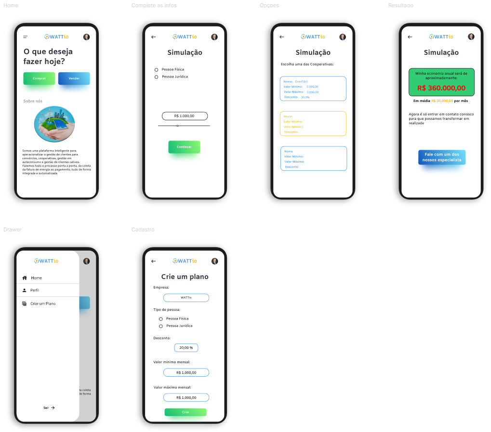
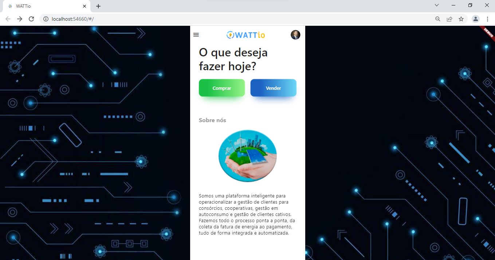

# Desafio Front-end Inowatt - WATTio

Foi desenvolvido um aplicativo em flutter assim como uma página web com o objetivo de cumprir as metas estabelecida pelo [desafio proposto.](../desafio_frontend_wattio.pdf)

Link da versão Web: https://desafio-wattio-jackson.web.app/

## Design

Foi desenvolvido uma prototipagem do aplicativo utilizando o [Figma:](https://www.figma.com/file/IK2bVIpih24uLJPn8srTU5/inowatt---watt.io?node-id=0%3A1)

Para a versão web não foi implementado responsabilidade mas foi realizado um design com customização do fundo e otimizações.

## Desafio proposto

Desenvolver uma aplicação onde o usuário deverá seguir os seguintes passos:
- entrar com o valor médio da conta de energia da própria casa/empresa, em R$;
- receber diferentes ofertas, a depender das Cooperativas cadastradas e seus
respectivos modelos de negócios;
- escolher uma dentre as ofertas disponíveis;
- calcular a economia baseada na oferta escolhida;

Enfim é necessário que a plataforma que faça a conexão entre as ofertas das Cooperativas e as demandas dos Clientes

**Modelo para inspiração:** https://desafio-marketplace-energia.web.app/#/
