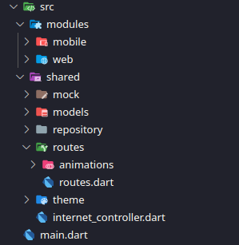
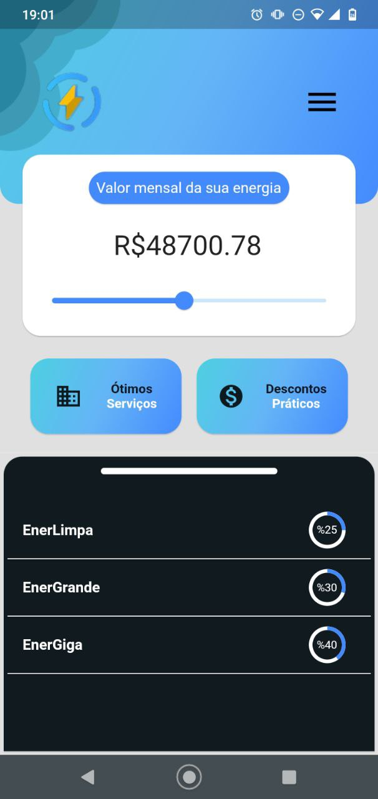
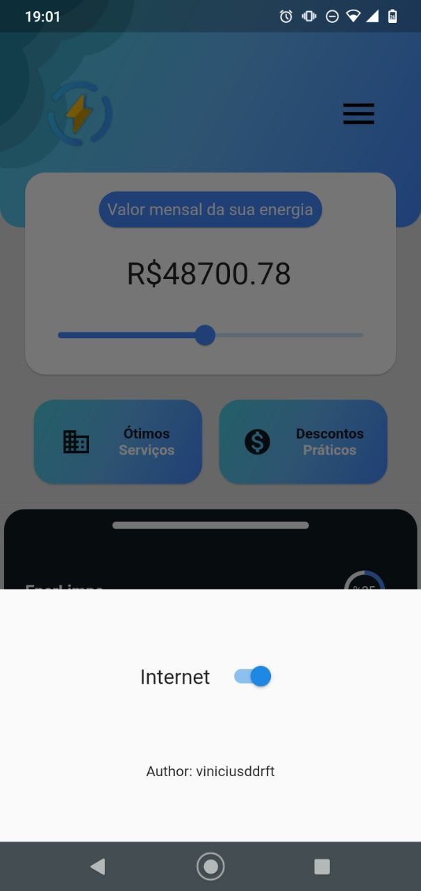
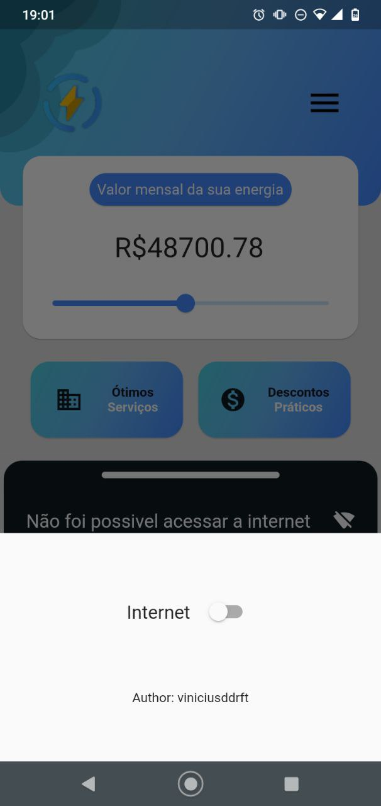
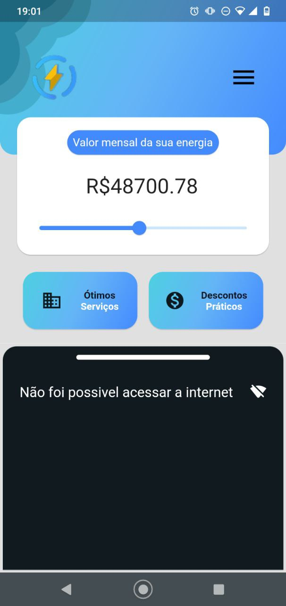
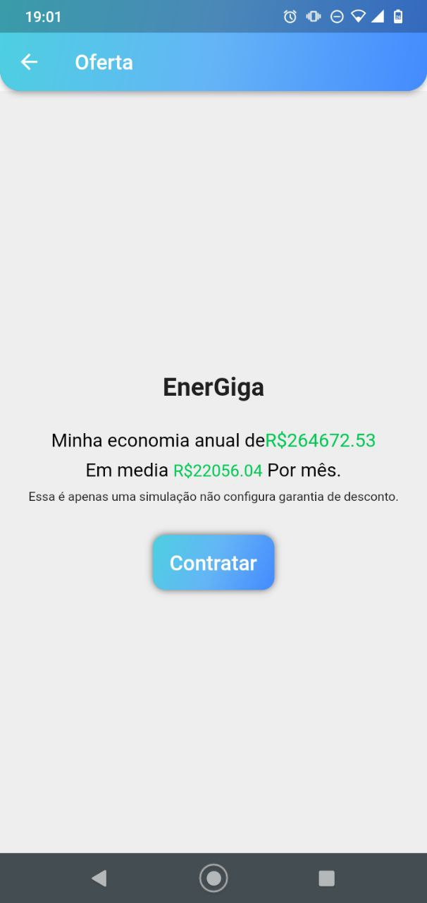
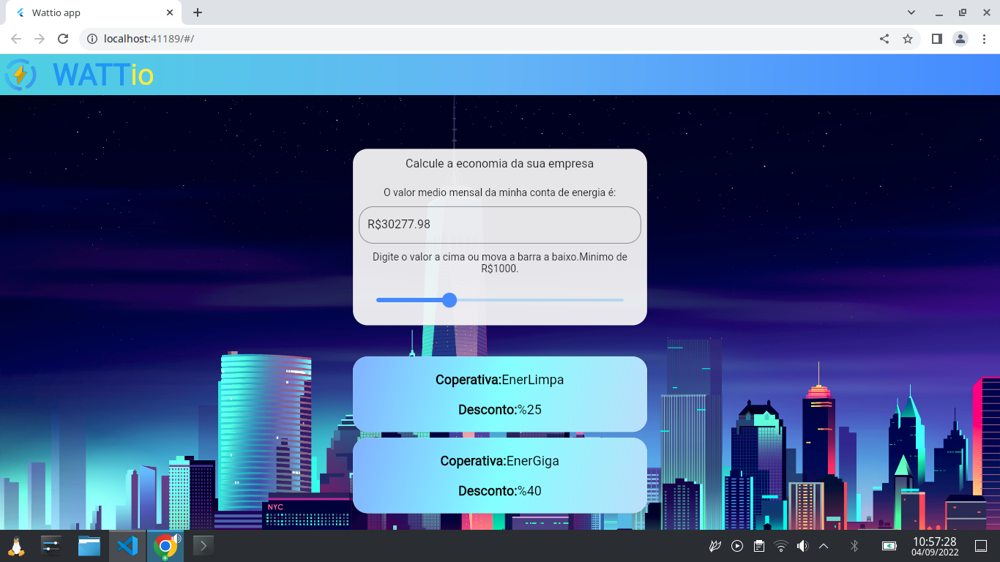
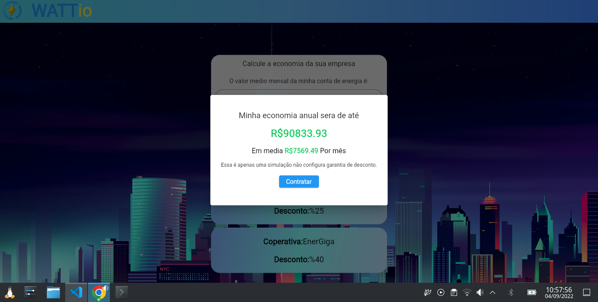
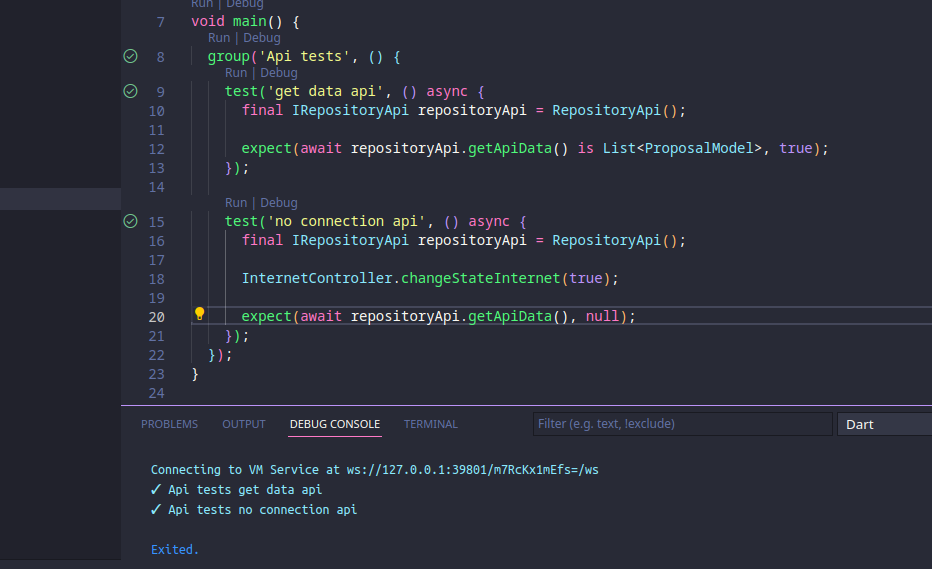

# WATTio app

O app foi feito usando somente as coisas nativas do flutter sem nenhum packge ou plugin, o projeto foi dividido entre mobile e web ambos com layouts diferentes eles consomem os dados do mesmo repository, o app conta com animações de transição de tela(somente mobile).

# Estrutura do projeto

 essa é a estrutura do projeto:

### Vamos falar sobre cada diretorio e como tudo foi organizado
<ul>
<li>src</li>
    
Esse diretório é onde fica todo código, o único arquivo fora dele é o main.dart.

<li>modules</li>
    
Aqui fica a divisão entre os layouts, entro de layout fica a divisão entre mobile e web.

<li>mobile</li>
    
Aqui ficam cada tela do mobile separada por outros diretórios e cada um com seu controller ali dentro e um diretório de componentes para fazer toda componentização.

<li>web</li>
    
Todo código de layout e controller do web ficam aqui exatamente como funciona no mobile.

<li>shared</li>
    
Aqui fica todo código que não é acoplado a uma única tela, pode ser usado por qualquer modulo do código.

<li>mock</li>
    
O mock contém uma classe com a api fake em formato de string para ser usada.

<li>models</li>
    
Models serve para transformar os dados da api em um objeto dart para usá-lo com mais facilidade.

<li>repository</li>
    
Os repositorys nessa estrutura são responsáveis por acessar qualquer coisa externa do app nesse caso consumir a api.

<li>routes</li>
    
Aqui ficam todas as rotas nomeadas.

<li>animations</li>
    
Nesse diretório fica o código de animação de transição de telas e por esse motivo ela está dentro de routes.

<li>theme</li>
    
Aqui fica as classes de images de app e qualquer coisa relacionada a design.

</ul>

## Mobile

 A versão mobile conta com esse design inspirado em um modelo feito no figma, só que com algumas mudanças de cor estilo fonte e outras coisas (O modelo figma não foi feito por mim).

<a href="https://www.figma.com/file/oYLjPBSIiYS0UMSIOO04MH/wattIO?node-id=0%3A1"> 
Modelo figma
</a>

Na versão mobile existe um botão de menu onde lá é possível "desativar a internet" e ver como o app se comportaria caso essa conexão falhasse(Apenas no mobile).

## Web

A versão web o design foi construído de forma bem diferente com imagens de fundo e outra estrutura.

A versão web não conta com o recurso de "desativar a internet" pois essa ideia perde o sentido na web que já precisa de internet para acessar o site.

## Testes

Aqui temos o teste validando 2 casos, o caso de pegar os dados da api e o caso de falha de conexão, os testes aqui validam a lógica por traz dessa implementação, aqui é testado esses dois possíveis retorno do repository.

Aqui os testes mostram que está tudo funcionando como deveria.

A conclusão do desafio foi essa, espero feedback sobre o projeto :)

